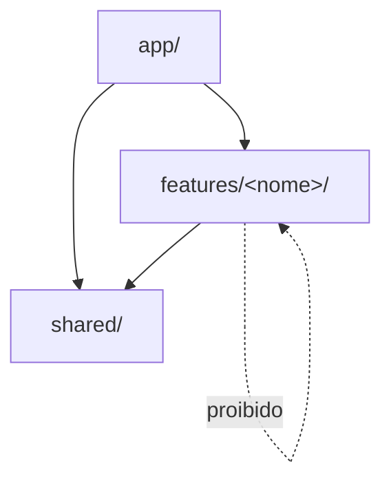
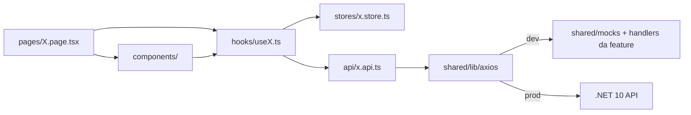

# Plano de Execução — FluxoDiario Frontend (MVP)

## Contexto

- Repositório [`fluxodiario-frontend`](README.md) está **vazio** (apenas `README.md` e `.gitignore`).
- Stack obrigatória definida em `requisitos_tecnicos_sistema_financeiro.pdf`: **React 18 + Vite + TypeScript + Shadcn/ui + Tailwind + Axios + Recharts**.
- Estado global: **Zustand** (escolha confirmada).
- Backend ainda **não existe** → usaremos **MSW (Mock Service Worker)** seguindo o contrato dos DTOs descritos no PDF, com camada de API desacoplada para que a troca para o backend real seja trivial (só remover o worker e ajustar `VITE_API_URL`).
- Gráficos: **Shadcn Chart (chart.tsx)** sobre Recharts, com paleta integrada ao tema.

## Arquitetura proposta — Feature-Based Architecture

Adotamos **Feature-Based Architecture** com 3 camadas estritas e regras de import bem definidas:

1. **`app/`** — camada de composição. Monta providers, router raiz e shell global. Só `app/` enxerga todas as features.
2. **`features/<nome>/`** — slice vertical autocontida: tem suas próprias `api`, `components`, `hooks`, `stores`, `schemas`, `types`, `pages`, `routes.tsx` e expõe **apenas o que for público via `index.ts` (barrel)**.
3. **`shared/`** — código transversal sem regra de negócio: UI Kit (Shadcn), utilitários, layout primitives, libs (axios, currency, date), tipos comuns, stores de UI, configuração e plumbing de mocks.

### Regras de boundary (forçadas por ESLint)



- `features/*` **não importam de outras features** (nem mesmo via barrel). Se duas features precisam falar, a comunicação acontece em `app/` (via router/layout) ou subindo o contrato para `shared/`.
- `shared/*` **não importa de `features/*` nem de `app/`**.
- Imports entre arquivos da mesma feature usam caminho relativo (`./components/...`); imports de outras camadas usam alias absoluto (`@/shared/...`, `@/features/...` apenas em `app/`).
- Regras aplicadas via `eslint-plugin-boundaries` + `eslint-plugin-import` no Fase 0.

### Fluxo de dados dentro de uma feature



## Estrutura de pastas

```
src/
  app/                          # SÓ composição
    providers/
      AppProviders.tsx          # Theme, Router, Toaster, ErrorBoundary
    router/
      AppRouter.tsx             # compõe routes de todas as features
      ProtectedRoute.tsx
      PublicRoute.tsx
    layouts/
      AppShell.tsx              # Sidebar + Topbar + <Outlet/>
      AuthLayout.tsx
    main.tsx
    App.tsx

  shared/                       # transversal, sem regra de negócio
    ui/                         # componentes Shadcn (gerados)
    components/
      MoneyInput.tsx
      ConfirmDialog.tsx
      EmptyState.tsx
      DataTable.tsx
      DateRangePicker.tsx
      PageHeader.tsx
    charts/                     # wrappers genéricos sobre shadcn chart
      DonutChart.tsx
      AreaChart.tsx
    lib/
      axios.ts                  # instância + interceptors
      currency.ts               # formatBRL, parseMoney
      date.ts                   # date-fns wrappers ptBR
      query-keys.ts
      cn.ts
    hooks/
      use-disclosure.ts
      use-debounce.ts
    stores/
      ui.store.ts               # tema, sidebar collapse
    types/
      api.ts                    # ApiError, Paginated<T>
      common.ts
    config/
      env.ts                    # leitura tipada de import.meta.env
      routes.ts                 # path constants compartilhados
    mocks/
      browser.ts                # setupWorker
      server.ts                 # opcional p/ testes
      db.ts                     # banco em memória compartilhado
      seed.ts
      index.ts                  # registra handlers de TODAS as features

  features/
    auth/
      api/
        auth.api.ts             # login, register, refresh, me, forgot...
        auth.handlers.ts        # MSW handlers desta feature
      components/
        LoginForm.tsx
        RegisterForm.tsx
        ForgotForm.tsx
      hooks/
        use-auth.ts
        use-current-user.ts
      stores/
        auth.store.ts           # user, status, actions
      schemas/
        auth.schemas.ts         # zod
      types/
        auth.types.ts
      pages/
        LoginPage.tsx
        RegisterPage.tsx
        ForgotPasswordPage.tsx
        ResetPasswordPage.tsx
      routes.tsx                # exporta RouteObject[]
      index.ts                  # public API: { authRoutes, useAuth, useCurrentUser }

    accounts/
      api/ components/ hooks/ stores/ schemas/ types/ pages/
      routes.tsx
      index.ts                  # { accountsRoutes, useAccounts }

    categories/
      api/ components/ hooks/ schemas/ types/ pages/
      routes.tsx
      index.ts                  # { categoriesRoutes, useCategories }

    transactions/
      api/ components/ hooks/ schemas/ types/ pages/
      routes.tsx
      index.ts                  # { transactionsRoutes, useTransactions }

    dashboard/
      api/ components/ hooks/ types/ pages/
      routes.tsx
      index.ts                  # { dashboardRoutes }

    reports/
      api/ components/ hooks/ types/ pages/
      routes.tsx                # /relatorios/extrato | /categorias | /evolucao
      index.ts                  # { reportsRoutes }
```

### Public API de cada feature (`index.ts`)

Cada feature expõe **apenas**:

- `xxxRoutes`: `RouteObject[]` consumido por `app/router/AppRouter.tsx`.
- Hooks/stores que outras camadas legitimamente precisam (ex.: `useCurrentUser` para o `Topbar`, `useAccounts` para o seletor de conta em `transactions` — quando inevitável, sobe para `shared/`).

Tudo o mais é **privado**: componentes, schemas, tipos internos e o cliente HTTP da feature.

### Aliases TS / Vite

```jsonc
// tsconfig.json paths
"@/app/*":       ["src/app/*"],
"@/shared/*":    ["src/shared/*"],
"@/features/*":  ["src/features/*"]
```

## Decisões técnicas chave

- **Estado de servidor**: Zustand para client state (auth, UI, prefs). Para cache de dados remotos usamos pequenos hooks `useAccounts()`, `useTransactions(filters)` que orquestram Axios + Zustand (sem React Query para manter o escopo do PDF — fácil de plugar depois).
- **Precisão monetária**: usar `Intl.NumberFormat('pt-BR', { style: 'currency', currency: 'BRL' })` para exibição e `string` (formato decimal) para tráfego com a API — nunca `number/float` em valores. Componente `MoneyInput` com máscara.
- **Datas**: `date-fns` + locale `pt-BR`.
- **Formulários**: `react-hook-form` + `zod` (com `@hookform/resolvers`).
- **Roteamento**: `react-router-dom v6` com `ProtectedRoute` / `PublicRoute` e lazy loading por rota.
- **Tema dark/light**: `next-themes` + tokens Tailwind do Shadcn.
- **Auth**: refresh token em **cookie HttpOnly** (responsabilidade do backend); o frontend só guarda o estado "logado" e o perfil em memória; em 401 o interceptor tenta `/auth/refresh` uma vez antes de deslogar.
- **PWA**: `vite-plugin-pwa` com manifest, ícones e service worker (cache-first para assets, network-first para API).

## Contrato de tipos (baseado nos PDFs)

Cada tipo vive **dentro da própria feature** (`features/<feat>/types/*.ts`). Tipos que cruzam múltiplas features (ex.: `Paginated<T>`, `ApiError`) ficam em `shared/types/`.

```ts
// features/accounts/types/account.types.ts
export type Account = { id: string; nome: string; saldoInicial: string; saldoAtual: string; criadoEm: string }

// features/categories/types/category.types.ts
export type Category = { id: string; nome: string; tipo: 'RECEITA' | 'DESPESA'; padrao: boolean }

// features/transactions/types/transaction.types.ts
export type Transaction = {
  id: string; contaId: string; categoriaId: string | null;
  valor: string; data: string; descricao: string;
  tipo: 'RECEITA' | 'DESPESA' | 'TRANSFERENCIA';
  recorrencia?: { tipo: 'MENSAL' | 'PARCELADO'; meses?: number; grupoId?: string }
}
```

## Fases de execução

### Fase 0 — Bootstrap + Boundaries (~1 dia)
- `npm create vite@latest . -- --template react-ts`
- Tailwind v3 + `tailwindcss-animate`
- `npx shadcn@latest init` (style "new-york", base color zinc, CSS variables) e configurar `components.json` apontando para `src/shared/ui` e `src/shared/lib/cn.ts`
- ESLint + Prettier + **`eslint-plugin-boundaries`** + `eslint-plugin-import` configurados com as regras de camada (`app` > `features` > `shared`, e `features/*` ⛔ `features/*`)
- `tsconfig.json` com paths `@/app/*`, `@/shared/*`, `@/features/*`; `vite.config.ts` espelhando aliases
- Esqueleto vazio das pastas (`app/`, `shared/`, `features/<cada>`) já com `index.ts` placeholder por feature
- `.env.example` com `VITE_API_URL`, `VITE_USE_MOCKS`

### Fase 1 — Shared UI + App Shell (~1 dia)
- Gerar componentes Shadcn em `shared/ui/`: `button input label card dialog sheet table form select dropdown-menu avatar separator tabs badge skeleton sonner tooltip popover calendar progress chart`
- `shared/components/`: `PageHeader`, `EmptyState`, `ConfirmDialog`, `MoneyInput`, `DateRangePicker`, `DataTable`
- `shared/stores/ui.store.ts` (tema, sidebar collapsed)
- `app/providers/AppProviders.tsx` (Theme via `next-themes`, Sonner, ErrorBoundary)
- `app/layouts/AppShell.tsx` (Sidebar colapsável + Topbar) e `AuthLayout.tsx`
- `app/router/AppRouter.tsx` montando `[...authRoutes, ...accountsRoutes, ...]` (cada feature ainda devolvendo placeholder)
- `ProtectedRoute` / `PublicRoute` e página 404

### Fase 2 — Shared data layer + Mocks (~1 dia)
- `shared/lib/axios.ts`: instância com `withCredentials`, interceptor de request (Authorization), de response (refresh em 401, toast em 500, redirect em 403). Helper `httpError(err)` retornando `ApiError` tipado.
- `shared/lib/currency.ts` (formatBRL, parseMoney), `shared/lib/date.ts` (date-fns + ptBR), `shared/lib/query-keys.ts`, `shared/config/env.ts`
- `shared/mocks/db.ts` (banco em memória) + `seed.ts` (categorias padrão)
- `shared/mocks/index.ts`: combina handlers exportados por cada feature (`import { authHandlers } from '@/features/auth/api/auth.handlers'` etc.). É a **única exceção** ao boundary: shared/mocks pode importar handlers de features porque o bundle de mocks só roda em dev.
- `shared/mocks/browser.ts` (setupWorker) inicializado condicionalmente em `app/main.tsx` quando `VITE_USE_MOCKS=true`

### Fase 3 — Feature `auth` (~1 dia)
Endpoints: `POST /auth/register|login|refresh|forgot-password|reset-password`, `GET /auth/me`.
- `features/auth/api/auth.api.ts` + `auth.handlers.ts` (MSW)
- `features/auth/stores/auth.store.ts` (user, status, login/logout/refreshMe)
- `features/auth/schemas/auth.schemas.ts` (zod)
- `features/auth/components/`: `LoginForm`, `RegisterForm`, `ForgotForm`, `ResetForm`
- `features/auth/pages/`: `LoginPage`, `RegisterPage`, `ForgotPasswordPage`, `ResetPasswordPage`
- `features/auth/routes.tsx` exporta `authRoutes` envoltos em `AuthLayout`
- `features/auth/index.ts` exporta `{ authRoutes, useCurrentUser, useAuthStore }` (consumidos pelo `ProtectedRoute` e `Topbar` em `app/`)

### Fase 4 — Feature `accounts` (~1 dia)
Endpoints: `GET/POST/PUT/DELETE /accounts`.
- `features/accounts/api/accounts.api.ts` + `accounts.handlers.ts`
- `features/accounts/stores/accounts.store.ts` (cache local da lista)
- `features/accounts/hooks/use-accounts.ts` (sync com API + store)
- `features/accounts/components/`: `AccountCard`, `AccountsGrid`, `AccountFormDialog`
- `features/accounts/pages/AccountsPage.tsx`
- `features/accounts/index.ts` exporta `{ accountsRoutes, useAccounts }` (será usado por `transactions` via o agregador, ver nota abaixo)

### Fase 5 — Feature `categories` (~0.5 dia)
Endpoints: `GET/POST/PUT/DELETE /categories`. Categorias padrão semeadas em `shared/mocks/seed.ts`.
- Estrutura igual à de `accounts`
- Página `/categorias` com `Tabs` Receita / Despesa + tabela com badge "padrão" (bloqueia editar/excluir)
- `index.ts` exporta `{ categoriesRoutes, useCategories }`

### Fase 6 — Feature `transactions` (~2 dias)
Endpoints: `GET /transactions?from&to&accountId&type&page`, `POST/PUT/DELETE /transactions`, `POST /transactions/transfer`, `POST /transactions/recurrent`.
- `features/transactions/api/*`, `hooks/use-transactions.ts`, `schemas/*`
- `components/`: `TransactionsTable`, `TransactionFilters`, `TransactionFormDialog`, `TransferDialog`, `RecurrenceFields`, `EditSeriesDialog` (somente esta / esta e futuras / todas)
- Página `/lancamentos`
- **Dependência cruzada `accounts` e `categories`**: `transactions` precisa do seletor de conta e do seletor de categoria. Para respeitar o boundary, criamos hooks "leves" em `shared/hooks/` ou expomos `useAccounts`/`useCategories` somente via `index.ts` das respectivas features e importamos via alias `@/features/accounts` (regra ESLint permite import **somente** do barrel raiz, nunca de subpastas internas).
- `index.ts` exporta `{ transactionsRoutes }`

### Fase 7 — Feature `dashboard` (~1 dia)
Endpoint: `GET /dashboard?month=YYYY-MM`.
- `components/`: `KpiCard`, `CategoryDonutChart`, `IncomeConsumptionBar`
- `hooks/use-dashboard.ts`
- Página `/` (home autenticada)
- Charts usam `shared/ui/chart` + `shared/charts/DonutChart`
- `index.ts` exporta `{ dashboardRoutes }`

### Fase 8 — Feature `reports` (~1.5 dia)
Endpoints: `GET /reports/cashflow`, `/reports/categories`, `/reports/equity?months=6`.
- 3 sub-páginas: `CashflowPage`, `CategoriesReportPage`, `EquityEvolutionPage`
- Reutiliza `shared/components/DataTable`, `DateRangePicker` e `shared/charts/AreaChart`
- `index.ts` exporta `{ reportsRoutes }`

### Fase 9 — PWA + polimento (~1 dia)
- `vite-plugin-pwa` (manifest pt-BR, theme color, ícones 192/512/maskable)
- Service worker offline-first para shell, network-first para `/api`
- Empty states ilustrados em todas as listagens
- Revisão de acessibilidade (foco visível, labels, contraste)
- README com diagrama da arquitetura por features e comandos (`npm i`, `npm run dev` com mocks, `npm run build`, `npm run preview`)

## Cronograma estimado

Total: **~9–10 dias úteis** (alinhado com as semanas 6 e 7 do cronograma do PDF de levantamento, com folga para polimento).

## Critérios de aceite

- Todas as funcionalidades dos módulos 2–4 do PDF de levantamento navegáveis e funcionais com mocks
- **Arquitetura por features respeitada**: ESLint falha o build se uma feature importar de outra (exceto barrel `index.ts`), ou se `shared/` importar de `features/` / `app/`
- Cada feature expõe somente sua `routes` e hooks/stores estritamente necessários via `index.ts`
- `app/router/AppRouter.tsx` é o único ponto que conhece todas as features
- Dashboard carrega em < 1s (mocks) com skeletons antes
- Tema dark/light persistente
- 100% responsivo (mobile-first até 1440px)
- Zero uso de `number` para valores monetários
- PWA instalável passando no Lighthouse PWA audit
- Troca para backend real = mudar `VITE_USE_MOCKS=false` e apontar `VITE_API_URL`, sem tocar em código de feature